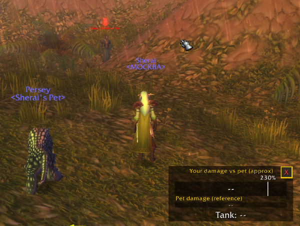
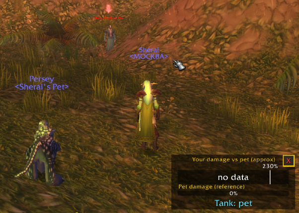
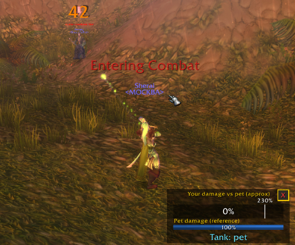
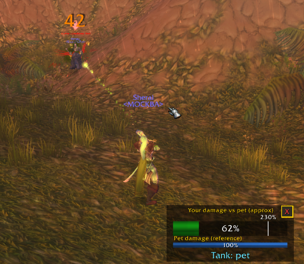
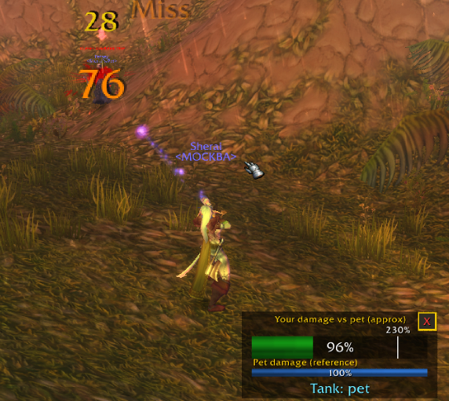
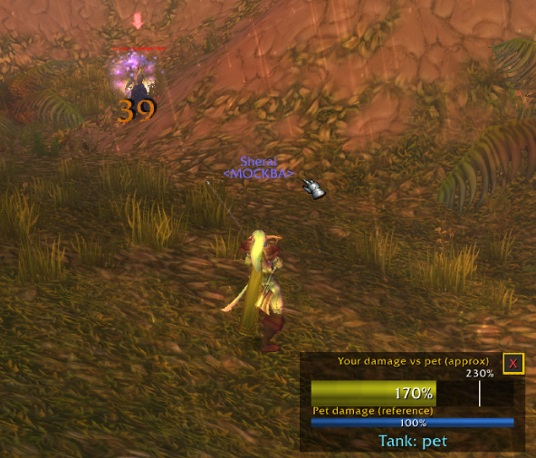
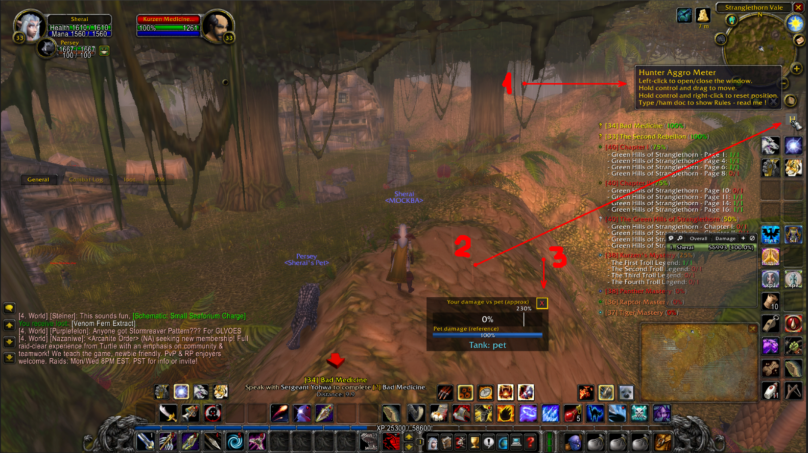

# Hunter Aggro Meter (Solo) version 1.23

*[Читать на русском](README.ru.md)*

A small WoW addon for Hunters who solo-farm with their pet tanking. It shows how close **you** are to pulling aggro off your pet, as a single bar with a threshold marker, plus a Feign Death helper.

## Screenshots

*Before combat — the window sits idle (empty bars, "Tank: --").*:


*Target selected, pet ready to engage. (Important: the pet attacks first, not you.)*:


*The moment of the first shot — the arrow is still in flight.*:



*The shot lands and the Hunter's aggro starts building.*:




*Aggro keeps climbing.*:



*Aggro has entered the yellow zone — it will turn red next, and the mob will pull off the pet.*:


.

...


The "H" button:

1. Opens a small menu of options.
2. Left-clicking it also shows/hides the addon window directly.
3. The window can also be closed the standard way, with the "X" button.

## Who this is for

This addon was built and tested on a **private server running a vanilla WoW 1.12-style engine** (not the official Blizzard Classic Era client). It auto-detects which API is actually available on your server and adapts:

- **If your server has a real threat API** (`UnitDetailedThreatSituation`, added in official Classic Era patch 1.13.5): the addon shows your *actual* threat relative to your pet. Accurate.
- **If it doesn't** (true vanilla 1.12 and most vanilla-style private servers): the addon estimates threat by comparing your damage output to your pet's damage output via the chat combat log. This is an **approximation**, not real threat data — treat it as a helpful indicator, not a guarantee.

If you're on the official Classic Era client, this addon will just work in the accurate mode automatically — no configuration needed.

## Features

- Single comparative bar: your aggro (or estimated damage share) vs. your pet's, with an adjustable threshold marker.
- Pet reference bar and a "who's tanking" status line.
- Healing your pet (Mend Pet) counts toward your threat too (50% of the heal amount), so you don't accidentally pull by spamming heals.
- **Feign Death support**: on activating FD, your aggro is remembered and the bar drops to 0 with an on-screen countdown. Your first action afterward restores aggro using a decaying formula (more is restored the sooner you act).
- Draggable window, a persistent toggle button, adjustable aggro threshold, and an in-game "Rules - read me!" help window.
- Settings are saved between sessions.

## Installation

1. Download this repository as a ZIP (green "Code" button → "Download ZIP"), or grab the latest ZIP from [Releases](../../releases) if available.
2. Extract it so you end up with a folder named `HunterAggroMeter` directly inside your `Interface\AddOns\` folder:
   ```
   World of Warcraft\Interface\AddOns\HunterAggroMeter\HunterAggroMeter.toc
   World of Warcraft\Interface\AddOns\HunterAggroMeter\HunterAggroMeter.lua
   ...
   ```
3. Restart the game (or `/reload`) and make sure the addon is enabled on the character-select AddOns list.

## Commands

All commands start with `/ham` (or `/aggro`):

| Command | What it does |
|---|---|
| `/ham` | Show the command list |
| `/ham show` | Show the window |
| `/ham hide` | Hide the window |
| `/ham lock` | Lock/unlock window dragging |
| `/ham sound` | Toggle the aggro-warning sound |
| `/ham reset` | Reset the window position |
| `/ham t <number>` | Set the aggro pull threshold, e.g. `/ham t 180` |
| `/ham doc` | Show the in-game "Rules - read me!" window |

There's also a small "H" button that stays on screen at all times (Ctrl+drag to move it, Ctrl+right-click to reset its position) — left-click it to open/close the main window.

## Known limitations

- On vanilla-style servers, this is a **damage-based approximation of threat, not real threat data**. Different abilities have different actual threat coefficients that this addon can't see.
- The event name used to detect pet healing (Mend Pet) for the threat bonus isn't officially documented for 1.12-era clients; a few plausible event names are registered as a best effort. If pet-heal threat isn't being picked up on your server, please open an issue.
- The Feign Death countdown is shown at a fixed screen position (there's no "attach text to the 3D character model" API available to addons), so it approximates being "under your character" only with a standard third-person camera.

## Testing notes

The addon is designed to make solo Hunter gameplay easier, specifically for keeping track of when aggro is about to pull off the pet.

Tested from level 20 to level 33. Threshold settings used during testing:

- Level 20: `/ham t 190`
- Level 27+: `/ham t 210`
- Level 30+: `/ham t 230`

It's not yet clear how this will need to change at higher levels — the underlying logic may need a more fundamental rework further on.

## Editing the Rules window text

The text shown by `/ham doc` lives in `RulesText.lua` (a Lua string). A plain-text copy for easy reading/editing is kept in `Rules_read_me.txt` — WoW addons can't read arbitrary files from disk at runtime, so if you edit the `.txt`, copy the same change into `RulesText.lua` for it to actually show up in-game.

## Changelog

See [`CHANGELOG.txt`](CHANGELOG.txt) for the full version history.

## License

MIT License — see [`LICENSE`](LICENSE). In short: do whatever you want with this (use, modify, redistribute, include in other projects), just keep the copyright notice. Provided as-is, no warranty.
